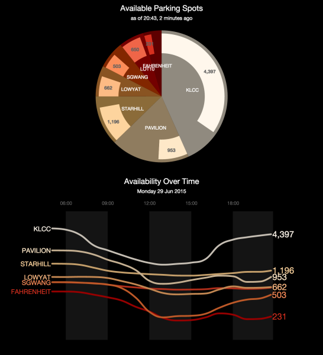

# :parking: apps/dbkl-parking

- Sample reports generated from api/dbkl-parking dataset


## Snapshot:




## Data

- Initial timeline data loaded from [api/dbkl-parking](/api/dbkl-parking/tree/master)

- Latest status received via subscription to pubnub channel:


```javascript
var pubnub = PUBNUB.init({
	publish_key: publish_key,
	subscribe_key: subscribe_key
});

pubnub.subscribe({
	channel: 'dbkl-parking',
	message: function(m){
		updateChart(msg);
	}
});


// pubnub message :
// {
//	"id":"PAVILION",
//	"time":"2015-06-30 08:04:11",
//	"occupied":"118",
//	"available":"2349"
// }

function updateChart(msg)	{

	// msg.time in YYYY-MM-dd HH:mm:SS
	var t = new Date(msg.time);

	// convert to mysql unix second
	var mysqltime = parseInt(+t/1000);


}

```
